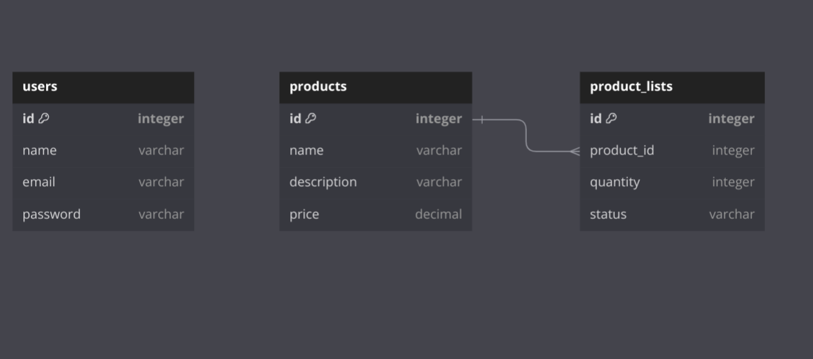

# Proyek Laravel JWT CRUD

## Penjelasan Proyek

Proyek ini adalah implementasi REST API menggunakan Laravel 8.0 dengan fitur CRUD (Create, Read, Update, Delete) untuk dua entitas: Product dan ProductList. Proyek ini juga menggunakan JWT (JSON Web Token) untuk autentikasi pengguna.

Fitur utama proyek ini meliputi:
1. Registrasi dan login pengguna dengan JWT
2. CRUD operasi untuk Product
3. CRUD operasi untuk ProductList
4. Pencarian data untuk Product dan ProductList
5. Autentikasi berbasis token untuk mengakses API

## Desain Database

Proyek ini menggunakan tiga tabel utama:

1. `users` (default Laravel)
   - id (primary key)
   - name
   - email
   - password
   - created_at
   - updated_at

2. `products`
   - id (primary key)
   - name
   - description
   - price
   - created_at
   - updated_at

3. `product_lists`
   - id (primary key)
   - product_id (foreign key ke products.id)
   - quantity
   - status
   - created_at
   - updated_at

Relasi:
- Satu Product dapat memiliki banyak ProductList (one-to-many)
- 

## Dependency

Proyek ini memiliki beberapa dependency utama:

1. PHP >= 7.3
2. Laravel 8.0
3. tymon/jwt-auth: ^1.0 (untuk autentikasi JWT)

Dependency lainnya dapat dilihat di file `composer.json`.

## Cara Menjalankan Proyek

1. Clone repository ini
2. Jalankan `composer install`
3. Salin `.env.example` menjadi `.env` dan sesuaikan konfigurasi database
4. Jalankan `php artisan key:generate`
5. Jalankan `php artisan jwt:secret`
6. Jalankan migrasi database dengan `php artisan migrate`
7. Jalankan server dengan `php artisan serve`

## Penggunaan API

### Autentikasi
- POST /api/register - Mendaftar pengguna baru
- POST /api/login - Login pengguna
- POST /api/logout - Logout pengguna (memerlukan token)
- POST /api/refresh - Refresh token (memerlukan token)

### Product
- GET /api/products - Mendapatkan semua produk
- POST /api/products - Membuat produk baru
- GET /api/products/{id} - Mendapatkan detail produk
- PUT /api/products/{id} - Mengupdate produk
- DELETE /api/products/{id} - Menghapus produk
- GET /api/products/search?query={keyword} - Mencari produk

### ProductList
- GET /api/product-lists - Mendapatkan semua daftar produk
- POST /api/product-lists - Membuat daftar produk baru
- GET /api/product-lists/{id} - Mendapatkan detail daftar produk
- PUT /api/product-lists/{id} - Mengupdate daftar produk
- DELETE /api/product-lists/{id} - Menghapus daftar produk
- GET /api/product-lists/search?query={keyword} - Mencari daftar produk

Semua endpoint kecuali register dan login memerlukan token JWT di header Authorization.
